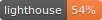

   

# Before you deploy

- [ ] Switch to production environmnet variables
- [ ] Update footer semver version
- [ ] Update snapshots and pass all tests
- [ ] npm run build
- [x] firebase deploy (Per's edit)

